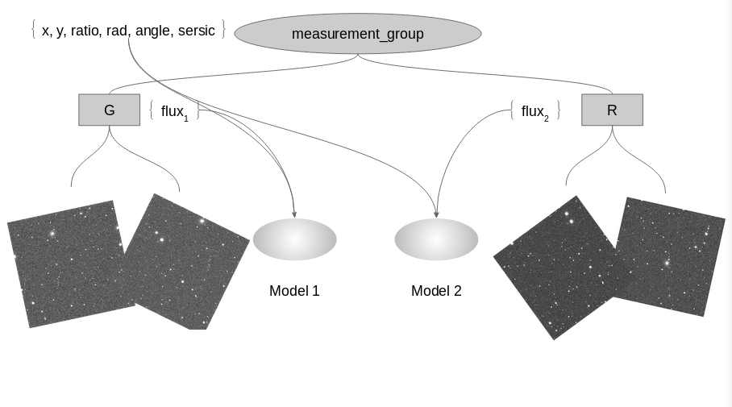

# Model fitting

Similar to the [multiframe measurements](../measurement/README.md),
when doing multiframe model fitting we are configuring a tree, where
the leaves are the images, and the intermediate nodes group of images,
or group of groups.

The Python code for this example is in [`modelfitting.py`](modelfitting.py), and
run as usual:

```bash
sextractor++ --config-file modelfitting.conf
```

You can see we use two types of parameters: Free and Dependent. There is
also a Constant type, but it is not used in this example.

### `FreeParameter`
are the ones that the least-squares engine will ultimately fit.
They have an initial guess, and a limiting range.

The initial guess can be a constant, like this:

```python
sersic = FreeParameter(2.0, Range((1.0, 7.0), RangeType.LINEAR))
```

Or a measured attribute, like this:

```python
rad_sersic = FreeParameter(
  lambda o: o.get_radius(),
  Range(lambda v, o: (.01 * v, 100 * v), RangeType.EXPONENTIAL)
)
```

Here, `o` would be the source that is to be fitted. On this second example
we can also see that the range is based on this initial guess (`v`), and
it is exponential: this is, it will grow faster towards the high limit.

For convenience, SourceXtractor defines some functions that return commonly
used free parameters, two being used here: `get_pos_parameters`
and `get_flux_parameter`.

### `DependentParameter`
are not fitted, but can be used to apply a transformation to a free parameter.
For instance:

```python
mag = DependentParameter(lambda f: -2.5 * np.log10(f) + args.mag_zeropoint, flux)
```

Here `mag` is a dependent parameter, that transforms the free parameter
`flux` into a magnitude.

In this particular case, this dependent parameter is only used for the output,
but they are not limited to this. They can be also used as an input for a model
or a prior.

For instance, a model could use a dependent parameter for its position,
based on the time delta of the frame (constant),
the position on the detection frame (free), and a proper motion (free).

`get_world_parameters` is another utility, but for dependent parameters:
it transforms coordinates in pixels, to world coordinates.

### Prior

The model fitting engine will try to reduce the residual, but it has no concept
of "reasonable" value. This is, a free parameter could be optimized to a value
with little physical meaning.

Priors help with this, fitting a parameter to a Gaussian with the given mean
and standard deviation.

If the parameter is not Gaussian - like the Sersic index here -, a change of
variable is done - left -, and then the prior added to this new, dependent,
variable:

```python
sersic0 = 4
nc = DependentParameter(lambda nt: np.exp(nt - sersic0), sersic)
add_prior(nc, 0.0, 1.0)
```


It is clear that the prior "pushes" the Sersic index free parameter to more
reasonable values.

### Overview of the tree

The resulting tree  for this example looks something like this,
only with three bands.



There are three models, as there are two free parameters modeling the
flux: g, r and i. The three models use the free parameters for the position
(`x, y`) and the shape (`ratio, rad, angle, sersic`)

Each of the three models will be fitted to the affected frames.

### Rasterization


As shown here, parameters are relative to the detection frame. Thus, its
rasterization is projected into each measurement frame individually, using a
higher resolution grid if the PSF is oversampled. After, the raster is
convolved by the PSF, and downsampled if needed.

The final low resolution raster is substracted from the measurement frame,
and that is the residual: ideally, there will be only noise.
